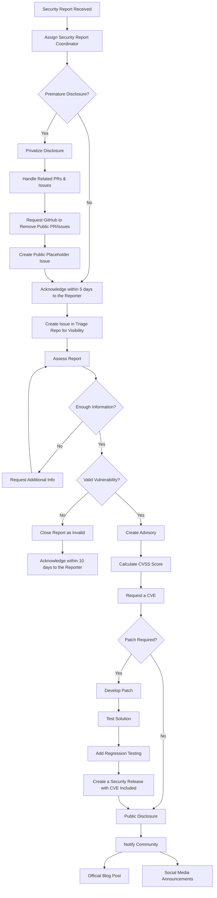

# Incident Response Plan

## Introduction
Security is a top priority for Lodash. This document outlines the **formal process** for handling **security reports**, including how to **triage**, **assess**, and **disclose** vulnerabilities responsibly.

## Scope

The [Security Triage Team][] will use this document as a process guide when a security vulnerability is reported, from triage to resolution. This process must align with the project's [SECURITY policy](SECURITY.md) and cannot diverge significantly.

## Security Report Handling Flowchart
The following diagram details the **decision-making process** for handling security reports:

## Roles & Responsibilities

### Finder

This person identifies a potential security vulnerability in the project. The Finder may or may not be the same person as the Reporter. If the Finder is not the Reporter, they may share the details with someone else who submits the report to the Security Triage Team.

**Responsibilities**
- Identify potential security vulnerabilities in the project.
- Share sufficient details about the vulnerability with the Reporter or directly with the Security Triage Team.

**Expectations**
- Follow responsible disclosure guidelines by ensuring the vulnerability is reported privately before public disclosure.
- Provide clear and accurate information about the vulnerability to facilitate the reporting process.

### Reporter

This person submits a security report to the Security Triage Team and provides detailed information about the suspected vulnerability. It is expected that the Reporter will cooperate with the Security Triage Team during this process and follow responsible disclosure guidelines.

**Responsibilities**
- Submit a security report to the Security Triage Team.

**Expectations**
- Provide detailed information about the suspected vulnerability.
- Follow responsible disclosure guidelines (report privately before public disclosure).
- Cooperate with the Security Triage Team by providing additional details when needed.
- Test and verify patches (when applicable).
- Respect security timelines and avoid premature public disclosure.

### Coordinator

This person acts as the focal point for a specific security report and ensures the report follows all responsible disclosure guidelines. The SRC coordinates the remediation process if a vulnerability is confirmed and ensures that the security report follows the process and necessary actions are taken. While the SRC is not necessarily responsible for performing analysis, remediation, or patching, they may take on these tasks if they also hold the role of Analyst or Remediation Developer.

**Responsibilities**
- Acknowledge receipt of security reports within the required timeframe.
- Orchestrate the embargo and identify the minimum set of individuals involved.
  - Remind everyone involved that they must not notify/involve any other individuals. If someone else needs to be involved, that must go through the Coordinator.
- Assign an Analyst to assess and validate the report.
- Ensure communication with the reporter throughout the process.
- Coordinate the remediation process if a vulnerability is confirmed.
- Oversee the advisory & CVE request process if applicable.
- Escalate critical vulnerabilities when necessary.
- Track all security reports for visibility and reporting.

**Requirements**
- Must be a member of the Security Triage Team.

### Analyst

**Responsibilities**
- Determine if the reported issue is a real vulnerability, and is in within the scope of our [threat model](threat-model.md)
- Validate proof-of-concept exploits
- Assess the security report and determine its severity (assist in CVSS).
- Validate the reported vulnerability against best practices.
- Identify potential mitigation strategies and workarounds.
- Prepare a report for the Security Report Coordinator.

### Remediation Developer

**Responsibilities**
- Develop a patch or solution based on the reported vulnerability.
- Ensure the patch follows best practices and is testable.
- Add test(s) to the existing test suite to confirm the vulnerability (pre-patch) and confirm the fix (post-patch).
- Test the patch to ensure it works as expected.
- Create a pull request to merge the patch into the project.

## Runbook

The following sections outline the **step-by-step process**, explaining each decision, scenario, and possible actions. In this guide we also include links that are private (limited to the Security Triage Team), a general overview of the process in flowchart format can be found [here](#security-report-handling-flowchart).

### Step 0: Security Report Received

A security vulnerability report is received via [official channels](SECURITY.md#reporting-a-security-issue) or otherwise (i.e. via third-party advisory services, blog post, social media, etc.).

Ideally, the report must contain **clear and detailed information** like (Affected versions, a small PoC/sample project demonstrating the issue, steps to reproduce, expected vs. actual behavior, potential impact...) but this might not be the case depending on the communication channel used. Later on we will try to collect this information and refine the report.

### Step 1: Assign Security Report Coordinator (SRC) and consolidate the report

1.1 One person from the Security Triage Team will volunteer and self-assign to oversee the case. It is expected that the person will remain assigned until the end of the process, so they effectively take the role of [the Security Report Coordinator (SRC)](#security-report-coordinator-src). 

> [!Note]
> While this document refers to a single SRC for simplicity, in practice, having two coordinators is acceptable and often beneficial. A second coordinator can assist with tasks such as reviewing the advisory content before it is published, ensuring accuracy and completeness.

1.2 If the report was created accidentally or intentionally in a public channel (e.g. GitHub issues), it is important to share this information ASAP in the private slack channel `#lodash-security-triage` so the Security Triage Team is aware of it. At this stage, our priority is to remove the report from public view as soon as possible and let the reporter know what happened next.

1.2.1 In the case of a report made public in a Pull request or issue under the Lodash GitHub organization the following process will be followed (by a Lodash TSC Member):

    * Move the issue to the private repository called [lodash/security-triage](https://github.com/lodash/security-triage).
    * For any related pull requests, create an associated issue in [lodash/security-triage](https://github.com/lodash/security-triage) repository. Add a copy of the patch for the pull request to the issue. Add screenshots of discussion from the pull request to the issue.
    * [Open a ticket with GitHub](https://support.github.com/contact) to delete the pull request using Lodash (team) as the account organization.
    * Force-push to the PR branch to overwrite the code with a placeholder commit (if "allow edits by maintainers" is enabled). This ensures sensitive information is removed immediately.
    * In the PR comments, notify the author about the force-push and explain the reason:
        > FYI @xxxx, we force-pushed to your branch to remove sensitive information while we work on releases in private.
    * Open a new issue in the public repository with the title `FYI - pull request deleted #YYYY`. Include an explanation for the user:
        > FYI @xxxx we asked GitHub to delete your pull request while we work on releases in private.
    * Update the team in the slack channel #lodash-security-triage`.

1.2.2 In the case that the report is made public in a different channel that we don't own/control, the Lodash TSC will attempt to mitigate this by trying to remove the report from public view (reporting to support, asking the reporter to remove the report, etc...).

1.3 At this stage the Security Report Coordinator (SRC) will create a (private) issue in [lodash/security-triage](https://github.com/lodash/security-triage) repository with the existing information from the security report unless it already exists (step 1.2.1). This issue will serve as the central discussion point for this particular report. At this stage is expected from the Security Report Coordinator (SRC) to acknowledge receipt of the security report to the reporter.

> [!Note]
> It is expected that the issue will be assigned to the Security Report Coordinator (SRC) and will remain open until the end of the process.

### Step 2: Review the Report and determine its severity

2.1 It is expected from the security triage team to review the report and determine its severity, also evaluating the impact on the project(s). In some cases the report might be too vague to properly determine its severity. In this case the Security Report Coordinator (SRC) will need to reach out to the reporter for more information and refine the report.

2.2 At this stage we are capable of determining the severity of the report based on the information provided and also if the report is still relevant. In case that the team has considered the report to be irrelevant or not valid, the Security Report Coordinator (SRC) will need to close the issue and inform the reporter that the report has been dismissed, ideally we can provide a reason for dismissal to prevent the report from being resubmitted within the project(s) in the future.

2.3 If the report is considered relevant and valid, the Security Report Coordinator (SRC) will create an advisory and request a CVE number. The Security Report Coordinator (SRC) will also include the remediation developer(s), analyst(s) and potentially the reporter in the advisory, so they can start to work on private fork to fix the security issue.

### Step 3: Patch and release

3.1 The security triage team will determine if this vulnerability will be patched and work on it. In case that the vulnerability won't be patched jump to step 4.

3.2 The mitigation team (remediation developer(s), analyst(s), reporter(s)) will work on the patch(es), re-evaluate the report once the patch is ready and include regression tests (when possible).

3.3 The Lodash TSC will announce publicly on a public issue that there is security patch available and the plan to do a release with an specific date (ideally) and the versions affected without providing additional information to prevent early disclosure.

3.4 The Lodash TSC will create the releases and publish them to npm.

### Step 4: Public disclosure

4.1 At this stage the Security Report Coordinator (SRC) will make the advisory public and close the coordination issue (opened in step 1).

4.2 The Security Report Coordinator (SRC) can ask the Lodash TSC to coordinate blog post or social media announcements using the OpenJS Foundation channels.

[Security Triage Team]: GOVERNANCE.md#security-triage-team
